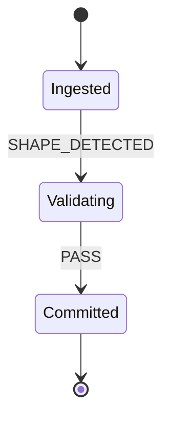

# Ledgrrr WASM Module

High-performance workflow compilation to WASM. Compiles Ledgrrr workflow definitions to Rhai state machines, Mermaid diagrams, and Rust enums—all in the browser.

## Features

- **Zero I/O**: Pure data transformation, no network or filesystem access
- **Tiny Bundle**: 163 KB WASM binary, ~3.3 KB TypeScript definitions
- **Multi-Format**: Single workflow → Rhai, Mermaid, Rust enum
- **Type Safe**: Full TypeScript support with generated type definitions
- **Validation**: Built-in workflow validation with detailed error messages

## Installation

Files are included in this directory:

```
functions/lib/ledgrrr-wasm/
├── ledger_workflow_wasm.js          # JavaScript wrapper
├── ledger_workflow_wasm.d.ts        # TypeScript definitions
├── ledger_workflow_wasm_bg.wasm     # WASM binary (163 KB)
├── ledger_workflow_wasm_bg.wasm.d.ts # WASM type defs
├── index.ts                          # High-level API
└── README.md                         # This file
```

## Usage

### Basic Workflow Compilation

```typescript
import { initWasm, compileWorkflow } from "@/functions/lib/ledgrrr-wasm";

// Initialize the WASM module once
await initWasm();

// Define your workflow
const workflow = {
  name: "ledger_ingest",
  version: "1",
  state: [
    { id: "Ingested", initial: true },
    { id: "Validating" },
    { id: "Committed", terminal: true },
  ],
  transition: [
    { from: "Ingested", event: "SHAPE_DETECTED", to: "Validating" },
    { from: "Validating", event: "PASS", to: "Committed" },
  ],
};

// Compile to all formats
const compiled = compileWorkflow(workflow);
console.log(compiled.mermaid);   // Mermaid diagram
console.log(compiled.rhai);      // Rhai state machine
console.log(compiled.rust_enum); // Rust enum
```

### Individual Format Compilation

```typescript
import {
  toMermaid,
  toRhai,
  toRustEnum,
  validateWorkflow,
} from "@/functions/lib/ledgrrr-wasm";

// Get just the Mermaid diagram
const diagram = toMermaid(workflow);

// Get just the Rhai code
const rhai = toRhai(workflow);

// Get just the Rust enum
const rustCode = toRustEnum(workflow);

// Validate without compiling
validateWorkflow(workflow); // Throws if invalid
```

## Workflow Schema

### State Definition

```typescript
interface WorkflowState {
  id: string;                 // State name
  initial?: boolean;          // True for starting state
  terminal?: boolean;         // True for end state
  is_error?: boolean;         // True for error states
}
```

### Transition Definition

```typescript
interface WorkflowTransition {
  from: string;              // Source state
  event: string;             // Event that triggers transition
  to: string;                // Destination state on success
  guard?: string;            // Optional condition (Rhai expression)
  else?: string;             // Fallback state if guard fails
}
```

### Validation Rules

1. **Exactly one initial state** - Must have exactly one state with `initial: true`
2. **Valid state references** - All `from`, `to`, and `else` must reference declared states
3. **Terminal state safety** - Terminal states have no outgoing transitions
4. **Guard completeness** - Transitions with `guard` must have `else`
5. **Non-terminal coverage** - Non-terminal states must have at least one outgoing transition

## Output Formats

### Mermaid Diagram

Generates `stateDiagram-v2` syntax for visualization:



### Rhai State Machine

Generates Rhai code with `next_state(state, event, ctx)` function:

```rhai
fn next_state(state, event, ctx) {
    switch [state, event.kind] {
        ["Ingested", "SHAPE_DETECTED"] => "Validating",
        ["Validating", "PASS"] => "Committed",
        _ => { error: "no transition", terminal: true }
    }
}
```

### Rust Enum

Generates type-safe Rust enum:

```rust
#[derive(Debug, Clone, Copy, PartialEq, Eq, Hash)]
pub enum PipelineState {
    Ingested,
    Validating,
    Committed,
}
```

## Error Handling

All functions throw `Error` on invalid input:

```typescript
try {
  const compiled = compileWorkflow(invalidWorkflow);
} catch (error) {
  console.error("Compilation failed:", error.message);
  // Error messages detail validation failures
}
```

## Performance

- **Compilation time**: < 1ms for typical workflows
- **Memory overhead**: ~2 MB WASM instance + heap
- **Bundle size**: 163 KB gzipped WASM binary

## Internals

The WASM module is built from the Rust `ledger-workflow-wasm` crate in the Ledgrrr monorepo:

```
vendor/l3dg3rr/crates/ledger-workflow-wasm/
```

**Build steps** (for maintainers):

```bash
cd vendor/l3dg3rr
cargo build --package ledger-workflow-wasm --target wasm32-unknown-unknown --release
wasm-bindgen target/wasm32-unknown-unknown/release/ledger_workflow_wasm.wasm \
  --out-dir functions/lib/ledgrrr-wasm --target web
```

## Examples

### Comic Generation Workflow

```typescript
const comicWorkflow = {
  name: "comic_generation",
  version: "1",
  state: [
    { id: "PromptReceived", initial: true },
    { id: "ImageGeneration" },
    { id: "SVGRendering" },
    { id: "Published", terminal: true },
  ],
  transition: [
    { from: "PromptReceived", event: "VALIDATE", to: "ImageGeneration" },
    { from: "ImageGeneration", event: "SUCCESS", to: "SVGRendering" },
    { from: "SVGRendering", event: "RENDER_COMPLETE", to: "Published" },
  ],
};

const compiled = compileWorkflow(comicWorkflow);
```

## License

MIT (same as Ledgrrr)
