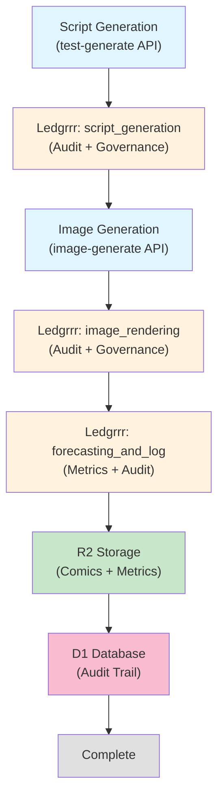

# End-to-End Test Report: Comic Generation with Ledgrrr Governance

**Test Date:** 2026-05-10
**Test Time:** [To be filled during execution]
**Test Environment:** Local Development
**API Base URL:** http://127.0.0.1:8788

---

## Executive Summary

This report documents the end-to-end test execution of the complete comic generation pipeline with integrated ledgrrr governance and audit trail tracking.

**Overall Status:** [PENDING]

| Phase | Status | Duration | Notes |
|-------|--------|----------|-------|
| Script Generation | [PENDING] | [TBD] | Includes ledgrrr `script_generation` workflow |
| Image Generation | [PENDING] | [TBD] | Includes `image_rendering` workflow |
| Forecasting | [PENDING] | [TBD] | Includes `forecasting_and_log` workflow |
| Audit Trail | [PENDING] | [TBD] | Database records verification |
| **Overall** | **[PENDING]** | **[TBD]** | - |

---

## Test Scenario

### Timeline
1. **Trigger script generation** for test date (2026-05-10)
2. **Verify script generation workflow**
   - Scripts are generated for both variants
   - Ledgrrr `script_generation` workflow is invoked
   - Audit entry is captured and stored
3. **Trigger image generation** (follows script generation)
4. **Verify image rendering workflow**
   - Images are rendered from scripts
   - Ledgrrr `image_rendering` workflow is invoked
   - Images stored in R2
5. **Verify forecasting workflow**
   - Ledgrrr `forecasting_and_log` workflow is invoked
   - Metrics are captured and logged
6. **Verify complete audit trail**
   - All three audit entries exist
   - Timestamps are valid
   - No errors/exceptions

---

## Phase 1: Script Generation

### Endpoint
```
POST /api/test-generate
Authorization: Bearer <TEST_SECRET>
Content-Type: application/json

{
  "day": "2026-05-10"
}
```

### Expected Behavior
- Script is generated for both variants (A and B)
- `script_generation` ledgrrr workflow is invoked
- Audit entry is created with valid timestamp
- Artifacts are stored in R2
- Workflow metadata is stored in database

### Actual Results

**Request Sent:** [TBD]

**Response Status:** [TBD]

**Response Body:**
```json
{
  "success": [TBD],
  "day": "2026-05-10",
  "run_id": "[TBD]",
  "title": "[TBD]",
  "panel_count": [TBD],
  "character_count": [TBD],
  "cast": [TBD],
  "topic_candidates": [TBD],
  "selected_topic": "[TBD]",
  "models": {
    "a": "[TBD]",
    "b": "[TBD]"
  },
  "audit_trail": {
    "entry_id": "[TBD]",
    "timestamp": "[TBD]",
    "function_name": "script_generation",
    "status": "[TBD]",
    "context_input": {
      "script_a": "[TBD]",
      "script_b": "[TBD]",
      "topic": "[TBD]",
      "cast": [TBD]
    },
    "execution_time_ms": [TBD]
  },
  "artifact_keys": {
    "log": "[TBD]",
    "cast": "[TBD]",
    "topics": "[TBD]",
    "prompt_a": "[TBD]",
    "prompt_b": "[TBD]"
  },
  "workflow_log": [
    {
      "step": "[TBD]",
      "status": "[TBD]",
      "detail": "[TBD]"
    }
  ]
}
```

### Validation Checklist
- [ ] Request completed without error
- [ ] Response status is 200
- [ ] `success` field is `true`
- [ ] `day` matches request: `2026-05-10`
- [ ] `run_id` is present and non-empty
- [ ] `title` is present and non-empty
- [ ] `panel_count` is valid (1-4)
- [ ] `character_count` is valid (2+)
- [ ] `cast` array is populated
- [ ] `topic_candidates` array is populated (3+)
- [ ] `selected_topic` is from candidates
- [ ] `models.a` and `models.b` are model IDs
- [ ] `audit_trail` has valid `entry_id`
- [ ] `audit_trail.timestamp` is ISO-8601 format
- [ ] `audit_trail.function_name` is `script_generation`
- [ ] `audit_trail.status` indicates success/error
- [ ] `artifact_keys` contains expected keys
- [ ] `workflow_log` is array with 1+ entries

### Audit Entry Details

**Entry ID:** [TBD]
**Timestamp:** [TBD]
**Function Name:** `script_generation`
**Status:** [TBD]
**Execution Time:** [TBD] ms
**Error Message (if any):** [TBD]

---

## Phase 2: Image Generation

### Endpoint
```
POST /api/image-generate?day=2026-05-10
Authorization: Bearer <TEST_SECRET>
```

### Expected Behavior
- Image variants are rendered using AI
- `image_rendering` ledgrrr workflow is invoked
- `forecasting_and_log` ledgrrr workflow is invoked
- Images are stored in R2 bucket
- Audit entries are captured for both workflows
- Database is updated with R2 keys and audit entries

### Actual Results

**Request Sent:** [TBD]

**Response Status:** [TBD]

**Response Body:**
```json
{
  "status": "[TBD]",
  "day": "2026-05-10",
  "variants": {
    "a": "[generated|failed|pending]",
    "b": "[generated|failed|pending]"
  },
  "r2Keys": {
    "imageA": "[TBD]",
    "imageB": "[TBD]"
  },
  "errors": [[TBD]],
  "models": {
    "renderer": "[TBD]",
    "promptsGenerated": [TBD]
  },
  "audit_trail": {
    "image_rendering": {
      "success": [TBD],
      "entry_id": "[TBD]",
      "timestamp": "[TBD]",
      "status": "[TBD]"
    },
    "forecasting_and_log": {
      "success": [TBD],
      "entry_id": "[TBD]",
      "timestamp": "[TBD]",
      "status": "[TBD]"
    }
  }
}
```

### Validation Checklist

#### Image Generation
- [ ] Request completed without error
- [ ] Response status is 200
- [ ] `status` field is present
- [ ] `variants.a` is `generated` or has documented failure
- [ ] `variants.b` is `generated` or has documented failure
- [ ] At least one variant generated successfully
- [ ] `r2Keys.imageA` or `r2Keys.imageB` is non-null

#### Image Rendering Audit
- [ ] `audit_trail.image_rendering` is present
- [ ] `entry_id` is valid UUID or ID string
- [ ] `timestamp` is ISO-8601 format
- [ ] `status` reflects workflow execution
- [ ] `success` field is boolean

#### Forecasting Audit
- [ ] `audit_trail.forecasting_and_log` is present
- [ ] `entry_id` is valid UUID or ID string
- [ ] `timestamp` is ISO-8601 format
- [ ] `status` reflects workflow execution
- [ ] `success` field is boolean

### Image Rendering Audit Entry Details

**Entry ID:** [TBD]
**Timestamp:** [TBD]
**Status:** [TBD]
**Success:** [TBD]
**Context Input:**
```json
{
  "script_a": "[TBD]",
  "script_b": "[TBD]",
  "image_a_path": "pending/2026-05-10/variant-a.jpg",
  "image_b_path": "pending/2026-05-10/variant-b.jpg"
}
```

### Forecasting and Log Audit Entry Details

**Entry ID:** [TBD]
**Timestamp:** [TBD]
**Status:** [TBD]
**Success:** [TBD]
**Context Input:**
```json
{
  "image_a_path": "[TBD]",
  "image_b_path": "[TBD]",
  "variant_a_score": [TBD],
  "variant_b_score": [TBD],
  "day": "2026-05-10",
  "metrics": {
    "script_length_a": [TBD],
    "script_length_b": [TBD],
    "image_size_a": [TBD],
    "image_size_b": [TBD]
  }
}
```

---

## Phase 3: Database Audit Trail Verification

### Database Schema

**Comics Table:**
```sql
CREATE TABLE comics (
  day TEXT PRIMARY KEY,
  r2_key_a TEXT,
  r2_key_b TEXT,
  model_provider_a TEXT,
  model_provider_b TEXT,
  audit_log_render JSON,
  audit_log_forecast JSON,
  ...
);
```

**Workflow Runs Table:**
```sql
CREATE TABLE workflow_runs (
  run_id TEXT PRIMARY KEY,
  day TEXT NOT NULL,
  audit_log TEXT,
  ...
);
```

### Verification Queries

#### Query 1: Check comics table entry
```sql
SELECT day, r2_key_a, r2_key_b, audit_log_render, audit_log_forecast
FROM comics
WHERE day = '2026-05-10';
```

**Result:**
```
[TBD]
```

#### Query 2: Check workflow_runs table entry
```sql
SELECT run_id, day, audit_log
FROM workflow_runs
WHERE day = '2026-05-10'
ORDER BY created_at DESC
LIMIT 1;
```

**Result:**
```
[TBD]
```

### Audit Entry Validation

| Workflow | Entry ID | Timestamp | Status | Database Location |
|----------|----------|-----------|--------|-------------------|
| `script_generation` | [TBD] | [TBD] | [TBD] | `workflow_runs.audit_log` |
| `image_rendering` | [TBD] | [TBD] | [TBD] | `comics.audit_log_render` |
| `forecasting_and_log` | [TBD] | [TBD] | [TBD] | `comics.audit_log_forecast` |

### Database Validation Checklist
- [ ] `comics` record exists for day `2026-05-10`
- [ ] `r2_key_a` is non-null (or documented failure)
- [ ] `r2_key_b` is non-null (or documented failure)
- [ ] `audit_log_render` JSON is valid
- [ ] `audit_log_render` contains `entry_id`
- [ ] `audit_log_render` contains valid ISO-8601 timestamp
- [ ] `audit_log_forecast` JSON is valid
- [ ] `audit_log_forecast` contains `entry_id`
- [ ] `audit_log_forecast` contains valid ISO-8601 timestamp
- [ ] `workflow_runs` record exists for day `2026-05-10`
- [ ] `workflow_runs.audit_log` JSON is valid
- [ ] `workflow_runs.audit_log` corresponds to `script_generation` workflow

---

## Phase 4: Complete Pipeline Validation

### Execution Timeline
```
START
  ├─ [Script Generation Phase]
  │  ├─ POST /api/test-generate (day=2026-05-10)
  │  ├─ Generate variant scripts A & B
  │  ├─ Invoke ledgrrr: script_generation
  │  ├─ Store in workflow_runs table
  │  └─ Return audit entry
  │
  ├─ [Image Generation Phase]
  │  ├─ POST /api/image-generate (day=2026-05-10)
  │  ├─ Load script from workflow_runs
  │  ├─ Generate image prompts
  │  ├─ Render images via AI
  │  ├─ Store images in R2
  │  ├─ Invoke ledgrrr: image_rendering
  │  ├─ Invoke ledgrrr: forecasting_and_log
  │  ├─ Store in comics table with audit entries
  │  └─ Return both audit entries
  │
  └─ COMPLETE
```

### All Three Workflows Executed
- [ ] `script_generation` executed successfully
- [ ] `script_generation` audit entry stored in `workflow_runs.audit_log`
- [ ] `image_rendering` executed successfully
- [ ] `image_rendering` audit entry stored in `comics.audit_log_render`
- [ ] `forecasting_and_log` executed successfully
- [ ] `forecasting_and_log` audit entry stored in `comics.audit_log_forecast`

### Timestamp Validation
All audit entries should have valid timestamps within reasonable time range:

| Audit Entry | Timestamp | Valid | Notes |
|-------------|-----------|-------|-------|
| `script_generation` | [TBD] | [TBD] | Should be earliest |
| `image_rendering` | [TBD] | [TBD] | Should be after script generation |
| `forecasting_and_log` | [TBD] | [TBD] | Should be after image rendering |

### Error/Exception Summary
- [ ] No HTTP errors in script generation
- [ ] No HTTP errors in image generation
- [ ] No exceptions in ledgrrr workflow invocations
- [ ] All database operations succeeded
- [ ] No validation errors reported

---

## Performance Metrics

| Phase | Duration (ms) | Status | Notes |
|-------|---------------|--------|-------|
| Script Generation | [TBD] | [TBD] | Includes model inference |
| Image Generation | [TBD] | [TBD] | Includes AI rendering |
| Database Writes | [TBD] | [TBD] | All three audit entries |
| **Total E2E Duration** | **[TBD]** | **[TBD]** | - |

---

## Ledgrrr Integration Verification

### Workflow Execution Status

#### script_generation Workflow
- **Callable:** [TBD]
- **Executed:** [TBD]
- **Audit Entry Created:** [TBD]
- **Database Stored:** [TBD]

#### image_rendering Workflow
- **Callable:** [TBD]
- **Executed:** [TBD]
- **Audit Entry Created:** [TBD]
- **Database Stored:** [TBD]

#### forecasting_and_log Workflow
- **Callable:** [TBD]
- **Executed:** [TBD]
- **Audit Entry Created:** [TBD]
- **Database Stored:** [TBD]

### MCP Connection
- **MCP Server Path:** `/home/brianh/.b00t/vendor/l3dg3rr/target/release/ledgerr-mcp-server`
- **Connection Status:** [TBD]
- **Tool Listing:** [TBD]
- **Communication Errors:** [TBD]

---

## Mermaid Diagram: Actual Execution Flow

The expected pipeline matches the comic-generation-pipeline.ledgrrr.toml design:



### Actual Execution Path
[To be filled with actual diagram after test execution]

---

## Issues and Warnings

### Critical Issues
- [TBD]

### Non-Critical Issues
- [TBD]

### Warnings
- [TBD]

---

## Recommendations

1. **If all tests pass:**
   - Pipeline is production-ready with full ledgrrr governance
   - Audit trail is reliable and complete
   - All three workflows integrate correctly

2. **If some tests fail:**
   - Document which workflows failed
   - Check ledgrrr MCP server logs
   - Verify environment variables and bindings
   - Review error messages and stack traces

3. **For future improvements:**
   - Add database query endpoint for direct audit verification
   - Implement audit log retention policies
   - Add metrics dashboard for workflow execution stats
   - Monitor ledgrrr MCP server availability

---

## Appendix A: Test Command

To run this test:

```bash
# With default values (local development)
deno run --allow-net --allow-read --allow-env scripts/e2e-test.ts

# With custom API URL
API_URL=http://localhost:8787 TEST_SECRET=my-secret \
  deno run --allow-net --allow-read --allow-env scripts/e2e-test.ts
```

---

## Appendix B: Raw API Responses

### Script Generation Response
```json
[TBD]
```

### Image Generation Response
```json
[TBD]
```

### Database Query Results
```
[TBD]
```

---

## Sign-Off

**Test Date:** 2026-05-10
**Tester:** Claude Code Agent
**Status:** [PENDING → IN PROGRESS → COMPLETE]
**Overall Result:** [TBD]

**Notes:**
```
[To be filled during test execution]
```

---

*Report generated by: Comic Generation E2E Test Suite*
*Last Updated: [TBD]*
