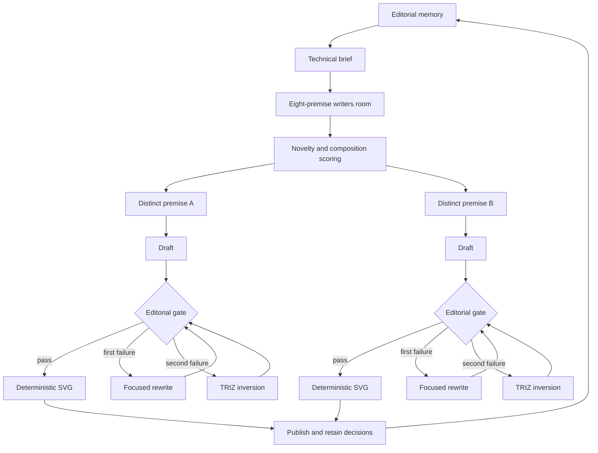

# Comic Generation Control Loops

The production workflow is a set of nested, bounded loops rather than a one-pass
generation pipeline.

## Loop Contracts

| Loop | State | Observation | Decision | Stop rule |
|---|---|---|---|---|
| Editorial memory | Last 60 strips | Titles and dialogue | Novelty penalty | Memory loaded or empty fallback |
| Premise room | Comic brief | Eight mechanisms/targets | Highest scores with distinct shapes | Two distinct premises selected |
| Script revision | Best draft | Six-dimension evaluation | Rewrite one cited weakness | Score at least 23/30 |
| TRIZ inversion | Failed rewrite | Weakest dimension | Reverse visuality, correctness, abstraction, or success | One inversion pass |
| Rendering | Accepted script | Typed panel fields | Deterministic SVG composition | Valid SVG artifact |

## Retained Decisions

Each run stores these R2 artifacts beneath `artifacts/{day}/{run_id}`:

- `brief.json`: technical truth, incentive mismatch, contradiction, and stakes.
- `premises.json`: ranked candidates, dimensions, and rejection issues.
- `decision.json`: selected premises, final script evaluations, and retry counts.
- `script-a.json` and `script-b.json`: accepted scripts.
- `prompt-a.txt` and `prompt-b.txt`: reproducible generation inputs.

Production reads do not generate comics. Cron or the authenticated rebuild endpoint
must complete the loop before `/api/today` publishes an artifact.
