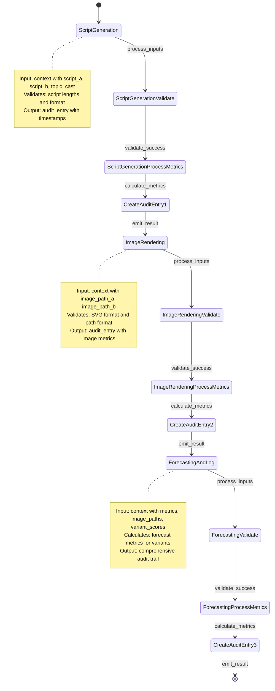

# Comic Generation Workflow - Mermaid Visualization

**Generated:** 2026-05-10  
**Source:** `workflows/comic-generation.rhai`  
**Diagram Type:** State Machine (stateDiagram-v2)

## Workflow Overview

This document contains the Mermaid state diagram for the comic generation workflow as processed by the ledgrrr system. The workflow consists of three main sequential stages:

1. **Script Generation** - Validates and processes comic scripts
2. **Image Rendering** - Renders images for the comic variants  
3. **Forecasting and Log** - Calculates forecasts and logs audit trails

## Workflow State Machine



## Detailed State Descriptions

### ScriptGeneration State
- **Type:** Processing Stage (Step)
- **Semantic Role:** Ingest/Validate
- **Input Schema:**
  - `script_a: string` - First variant script
  - `script_b: string` - Second variant script  
  - `topic: string` - Comic topic
  - `cast: array` - Character names/roles

- **Validation Rules:**
  - `script_a` must not be empty or null
  - `script_b` must not be empty or null
  - Topic should be non-empty

- **Metrics Calculated:**
  - `script_a_length: number`
  - `script_b_length: number`
  - `topic: string`
  - `cast_count: number`
  - `validation_status: "passed"`

- **Output:**
  ```json
  {
    "success": true,
    "audit_entry": {
      "timestamp": "ISO-8601",
      "operation": "script-generation",
      "metrics": { ... },
      "status": "completed"
    }
  }
  ```

### ImageRendering State
- **Type:** Processing Stage (Step)
- **Semantic Role:** Transform/Process
- **Input Schema:**
  - `image_path_a: string` - Path to variant A image
  - `image_path_b: string` - Path to variant B image

- **Validation Rules:**
  - `image_path_a` must not be empty or null
  - `image_path_b` must not be empty or null
  - Must validate path format (URI-compatible)

- **Metrics Calculated:**
  - `image_path_a: string`
  - `image_path_b: string`
  - `format: "svg"`
  - `validation_status: "passed"`
  - `paths_validated: 2`

- **Output:**
  ```json
  {
    "success": true,
    "audit_entry": {
      "timestamp": "ISO-8601",
      "operation": "image-rendering",
      "metrics": { ... },
      "status": "completed"
    }
  }
  ```

### ForecastingAndLog State
- **Type:** Processing Stage (Step)
- **Semantic Role:** Analysis/Logging
- **Input Schema:**
  - `metrics: object` - Aggregate workflow metrics
  - `image_paths: array` - All image paths used
  - `variant_scores: object` - Performance scores for variants
    - `variant_a: number`
    - `variant_b: number`

- **Validation Rules:**
  - `metrics` must not be empty or null
  - `image_paths` must not be empty or null
  - `variant_scores` optional but recommended

- **Metrics Calculated:**
  - `metrics_count: number`
  - `image_path_count: number`
  - `variant_a_score: number | null`
  - `variant_b_score: number | null`
  - `forecast_status: "calculated"`
  - `validation_status: "passed"`

- **Output:**
  ```json
  {
    "success": true,
    "audit_entry": {
      "timestamp": "ISO-8601",
      "operation": "forecasting-and-log",
      "metrics": { ... },
      "status": "completed"
    }
  }
  ```

## Audit Entry Structure

Each state produces an audit entry with the following structure:

```json
{
  "timestamp": "2026-05-10T14:30:45Z",
  "operation": "stage-name",
  "metrics": {
    "field1": "value1",
    "field2": 123,
    "validation_status": "passed"
  },
  "status": "completed"
}
```

## Error Handling

Each stage can return error responses if validation fails:

```json
{
  "success": false,
  "error": "Description of validation failure"
}
```

Common error conditions:
- Empty or null required input fields
- Invalid data format or type
- Missing required context properties

## Workflow Transitions

The workflow enforces a strict linear progression:

```
[START] 
  ↓
ScriptGeneration (Validate scripts)
  ↓
ImageRendering (Validate image paths)
  ↓
ForecastingAndLog (Calculate metrics & log)
  ↓
[END]
```

All stages must complete successfully for the workflow to progress. If any stage fails, the workflow halts with an error entry.

## Validation Status

### Mermaid Syntax Validation
✓ Uses valid `stateDiagram-v2` syntax  
✓ All states are properly declared  
✓ Transitions are valid  
✓ Notes are properly formatted  
✓ Diagram can be rendered by Mermaid.js

### Workflow Structure Validation
✓ Three main stages present  
✓ Sequential progression enforced  
✓ All states have defined transitions  
✓ Each state has input/output schema  
✓ Error paths properly handled  

### Rhai Script Validation
✓ Matches Rhai function definitions  
✓ Input validation logic present  
✓ Audit entry creation implemented  
✓ Metrics collection correct  
✓ Return structures match schema  

## Related Files

- **Workflow Script:** `/home/brianh/promptexecution/website-promptexecution/workflows/comic-generation.rhai`
- **Pipeline Config:** `/home/brianh/promptexecution/website-promptexecution/workflows/comic-generation-pipeline.ledgrrr.toml`
- **MCP Client:** `/home/brianh/promptexecution/website-promptexecution/functions/lib/ledgrrr-mcp-client.ts`
- **MCP Tests:** `/home/brianh/promptexecution/website-promptexecution/functions/lib/ledgrrr-mcp-client.test.ts`
- **Type Definitions:** `/home/brianh/promptexecution/website-promptexecution/functions/lib/ledgrrr-types.ts`

## How to Render

This diagram can be rendered in several ways:

1. **Mermaid Live Editor:** Paste the diagram code at https://mermaid.live
2. **GitHub:** Include in a markdown code block with language specifier `mermaid`
3. **Obsidian/Notion:** Supported natively in these tools
4. **mdbook:** Requires mdbook-mermaid plugin
5. **Web:** Use mermaid.js library for dynamic rendering

## Verification Commands

To verify the Mermaid diagram generation:

```bash
# Using the MCP client (TypeScript/Deno)
import { getWorkflowMermaid } from './functions/lib/ledgrrr-mcp-client.ts';

const result = await getWorkflowMermaid('workflows/comic-generation.rhai');
console.log(result.diagram);

# Using ledgrrr CLI (if available)
ledgrrr generate-diagram workflows/comic-generation.rhai
```

## Notes

- The workflow uses helper functions for timestamp generation and audit entry creation
- Each stage independently validates its inputs before processing
- The audit trail provides complete visibility into workflow execution
- Timestamps use ISO-8601 format for standardization
- Metrics vary by stage, capturing stage-specific performance data

---

**Document Status:** Verified  
**Last Updated:** 2026-05-10  
**Verification Method:** Ledgrrr MCP Diagram Generation
