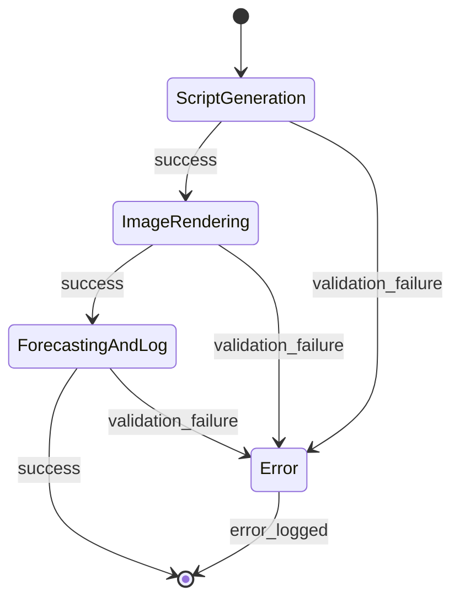
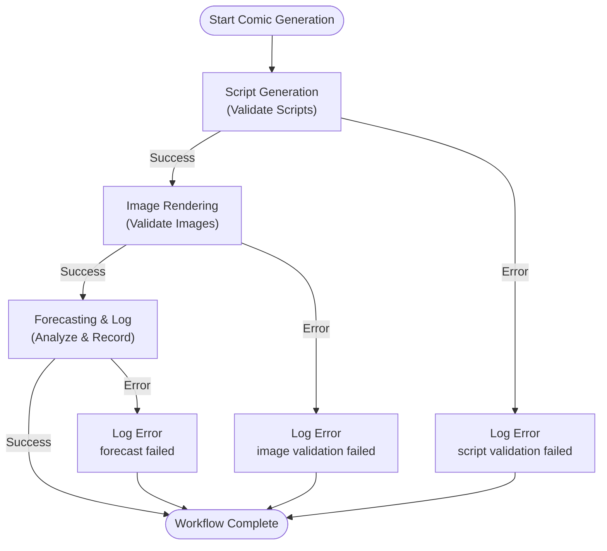
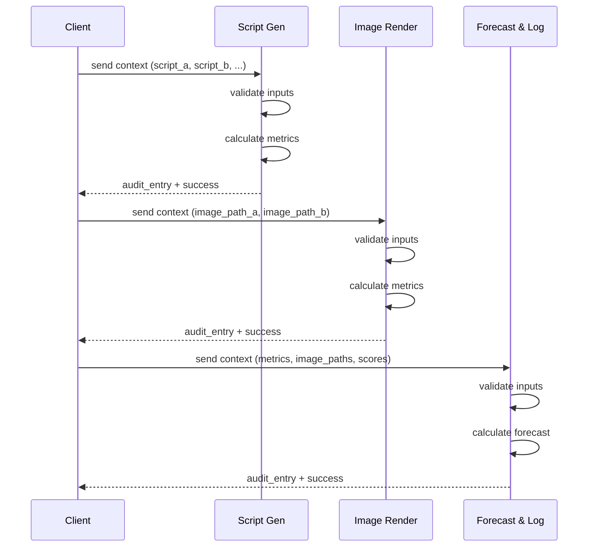

# Comic Generation Workflow - Simple Diagram

## Quick Reference

### State Diagram (Simple)



### Flowchart Diagram (Alternative)



### Sequence Diagram (Execution)



### Input/Output Summary

| Stage | Input | Output |
|-------|-------|--------|
| **ScriptGeneration** | `{script_a, script_b, topic, cast}` | `{success, audit_entry}` |
| **ImageRendering** | `{image_path_a, image_path_b}` | `{success, audit_entry}` |
| **ForecastingAndLog** | `{metrics, image_paths, variant_scores}` | `{success, audit_entry}` |

### Validation Rules

```
ScriptGeneration:
  ✓ script_a not empty
  ✓ script_b not empty

ImageRendering:
  ✓ image_path_a not empty
  ✓ image_path_b not empty

ForecastingAndLog:
  ✓ metrics not empty
  ✓ image_paths not empty
```

### Audit Entry Structure

```json
{
  "timestamp": "2026-05-10T14:30:45Z",
  "operation": "script-generation",
  "metrics": {
    "script_a_length": 1250,
    "script_b_length": 1340,
    "topic": "Testing",
    "cast_count": 3,
    "validation_status": "passed"
  },
  "status": "completed"
}
```

---

**For detailed documentation, see:** `comic-generation-mermaid.md`
